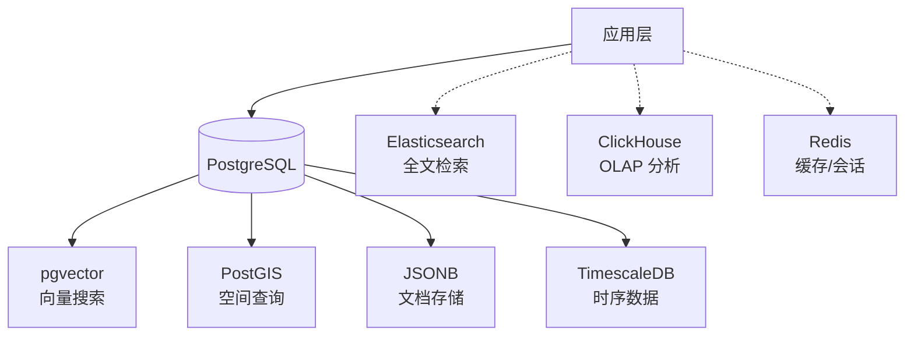

# PostgreSQL 扩展 vs 专用数据库 🆚

PostgreSQL 的扩展生态越来越强大，很多场景已经可以用「PostgreSQL + 扩展」替代专用数据库。本文逐一对比。

---

## 1. pgvector → 向量数据库竞品

### 对比对象

| 方案 | 类型 | 代表作 |
|------|------|--------|
| **pgvector** | PG 扩展 | PostgreSQL + pgvector |
| **专用向量数据库** | 独立 DB | Pinecone, Milvus, Weaviate, Qdrant |

### 维度对比

| 维度 | pgvector | 专用向量数据库 |
|------|----------|----------------|
| **部署复杂度** | ✅ 零额外运维（已有 PG） | ❌ 独立集群，多一套运维 |
| **数据一致性** | ✅ 强一致 ACID | ⚠️ 最终一致居多 |
| **混合搜索** | ✅ 向量 + SQL WHERE/FTS 同库 | ❌ 需两套系统或额外网关 |
| **百万级检索** | ⚠️ HNSW 索引约 1ms | ✅ 0.1-0.5ms |
| **亿级检索** | ❌ 内存压力大 | ✅ 分布式分片 |
| **多模态向量** | ⚠️ 仅浮点/半精度 | ✅ 支持 binary/稀疏/量化 |
| **过滤后搜索** | ✅ 先 WHERE 再 ANN（1.1.0+ 预过滤优化） | ✅ 各有实现 |

### 选型建议

```
数据量 < 1000 万，已有 PostgreSQL → ✅ pgvector（零额外成本）
数据量 > 1 亿，对延迟极度敏感 → ✅ Milvus / Qdrant
需要全托管免运维 → ✅ Pinecone
需要向量 + 业务数据强一致 → ✅ pgvector
```

---

## 2. PostGIS → 空间数据库竞品

### 对比对象

| 方案 | 类型 | 代表作 |
|------|------|--------|
| **PostGIS** | PG 扩展 | PostgreSQL + PostGIS |
| **专用空间数据库** | 独立 DB | MongoDB Geo, Elasticsearch Geo |
| **GIS 引擎** | 中间件 | GeoServer, MapServer |

### 维度对比

| 维度 | PostGIS | MongoDB Geo | Elasticsearch Geo |
|------|---------|-------------|-------------------|
| **SQL 支持** | ✅ 完整 SQL + 空间函数 | ❌ MQL 查询 | ❌ DSL 查询 |
| **空间函数丰富度** | ✅ **400+** 函数 | ⚠️ ~30 函数 | ⚠️ ~20 函数 |
| **坐标系支持** | ✅ 平面 + 球面 + 投影 | ❌ 仅 WGS84 | ⚠️ 有限 |
| **拓扑处理** | ✅ ST_Touches/Contains 等 | ❌ | ❌ |
| **栅格数据** | ✅ PostGIS Raster | ❌ | ❌ |
| **路径规划** | ✅ pgRouting | ❌ | ❌ |
| **集群扩展** | ⚠️ PG 集群方案 | ✅ 原生分片 | ✅ 原生分片 |
| **GIS 标准** | ✅ OGC 标准实现 | ❌ 私有 API | ❌ 私有 API |

### 选型建议

```
需要 GIS 标准合规、空间分析复杂 → ✅ PostGIS（压倒性优势）
简单 "查找附近" 场景 → ✅ MongoDB Geo 已够用
全文搜索 + 地理位置 → ✅ Elasticsearch Geo
需要路径规划 / 拓扑分析 → ✅ PostGIS（唯一选择）
```

---

## 3. TimescaleDB → 时序数据库竞品

### 对比对象

| 方案 | 类型 | 代表作 |
|------|------|--------|
| **TimescaleDB** | PG 扩展 | PostgreSQL + TimescaleDB |
| **专用时序数据库** | 独立 DB | InfluxDB, ClickHouse, VictoriaMetrics |

### 维度对比

| 维度 | TimescaleDB | InfluxDB 2.x | ClickHouse |
|------|-------------|--------------|------------|
| **SQL 支持** | ✅ 完整 SQL | ⚠️ Flux / SQL (v3) | ✅ SQL 子集 |
| **JOIN 能力** | ✅ PG 全部 JOIN | ❌ 极弱 | ⚠️ 有限 |
| **数据压缩** | ✅ 列式压缩 | ✅ TSM 压缩 | ✅ LZ4/ZSTD |
| **连续聚合** | ✅ 自动物化视图 | ✅ Tasks | ✅ 物化视图 |
| **保留策略** | ✅ 自动化 | ✅ Bucket 策略 | ✅ TTL |
| **写入吞吐** | ⚠️ 万级/秒 | ✅ 百万/秒 | ✅ 百万/秒 |
| **千亿级查询** | ⚠️ 中等 | ❌ 慢 | ✅ 极快 |
| **与业务数据关联** | ✅ 同库 JOIN | ❌ 需 ETL | ⚠️ 有限 |
| **运维成本** | ✅ PG 生态 | ✅ 单机简单 | ⚠️ 集群复杂 |

### 选型建议

```
已经用 PG，时序数据量 < 10 亿/天 → ✅ TimescaleDB（无需额外系统）
IoT / 传感器百万级写入 → ✅ InfluxDB（行协议写入效率最高）
OLAP 分析 > 千亿行 → ✅ ClickHouse（列存 + 向量化最快）
时序数据需要和业务表 JOIN → ✅ TimescaleDB（同库 JOIN 优势）
```

---

## 4. PG 全文检索 → 搜索引擎竞品

### 对比对象

| 方案 | 类型 | 代表作 |
|------|------|--------|
| **PG FTS** | PG 内置 + pg_trgm | PostgreSQL tsvector/tsquery + trigram |
| **专用搜索引擎** | 独立 DB | Elasticsearch, Meilisearch, Sonic |

### 维度对比

| 维度 | PG FTS + pg_trgm | Elasticsearch | Meilisearch |
|------|------------------|---------------|-------------|
| **索引速度** | ⚠️ 中等 | ✅ 快 | ✅ 极快 |
| **中文分词** | ❌ SCWS 插件 | ✅ IK 分词 | ⚠️ 基础 |
| **相关性排序** | ⚠️ 基础 ts_rank | ✅ BM25 + 多因素 | ✅ 默认智能排序 |
| **模糊搜索** | ✅ pg_trgm | ✅ fuzzy | ✅ typo-tolerance |
| **高亮** | ⚠️ 需手写 | ✅ 内置 | ✅ 内置 |
| **聚合/聚合** | ❌ | ✅ 强大 | ⚠️ 基础 |
| **分布式** | ❌ | ✅ 原生 | ⚠️ 有限 |
| **与业务数据 JOIN** | ✅ 同库 | ❌ 需双写 | ❌ 需双写 |

### 选型建议

```
简单站内搜索，< 100 万文档 → ✅ PG FTS + pg_trgm（免维护）
全文搜索为核心功能，中文分词要求高 → ✅ Elasticsearch
搜索体验优先，快速上线 → ✅ Meilisearch
搜索数据需要和业务数据强一致 JOIN → ✅ PG FTS（同库优势）
```

---

## 5. JSONB → 文档数据库竞品

### 对比对象

| 方案 | 类型 | 代表作 |
|------|------|--------|
| **PG JSONB** | PG 数据类型 | PostgreSQL + JSONB + GIN 索引 |
| **专用文档数据库** | 独立 DB | MongoDB |

### 维度对比

| 维度 | PostgreSQL JSONB | MongoDB |
|------|------------------|---------|
| **写入性能** | ⚠️ 中等（WAL 开销） | ✅ 更高（无 JOIN 约束） |
| **查询语法** | ✅ SQL `->>`, `@>`, `?` | ⚠️ MQL 学习曲线 |
| **二级索引** | ✅ GIN + 表达式索引 | ✅ 丰富 |
| **ACID 事务** | ✅ 完整 | ⚠️ 4.0+ 有限 |
| **Schema 约束** | ✅ 可混合关系 + JSONB | ❌ 无 schema |
| **聚合管道** | ❌ JSONB 较弱 | ✅ 强大的 $lookup/$group/... |
| **分片集群** | ⚠️ PG 扩展方案 | ✅ 原生分片 |
| **嵌套文档操作** | ⚠️ 不如 MongoDB 方便 | ✅ $push/$pull/$addToSet |

### 选型建议

```
需要关系型 + 文档型混合 → ✅ JSONB（PG 独一无二的优势）
文档是核心存储模型，无关联数据 → ✅ MongoDB
ACID 事务和数据完整性优先 → ✅ PostgreSQL JSONB
高写入吞吐 + 灵活 schema → ✅ MongoDB
```

---

## 6. AGE / PGQ → 图数据库竞品

### 对比对象

| 方案 | 类型 | 代表作 |
|------|------|--------|
| **Apache AGE** | PG 扩展 | PostgreSQL + AGE（openCypher） |
| **专用图数据库** | 独立 DB | Neo4j |

### 维度对比

| 维度 | Apache AGE (PG) | Neo4j |
|------|-----------------|-------|
| **查询语言** | ✅ openCypher + SQL 混合 | ⚠️ Cypher 纯图查询 |
| **与关系数据 JOIN** | ✅ SQL 直接 JOIN PG 表 | ❌ 需导出/导入 |
| **ACID** | ✅ PG 事务 | ✅ 原生 |
| **图算法** | ⚠️ 有限 | ✅ 60+ 算法（PageRank, LPA...） |
| **可视化** | ❌ | ✅ Neo4j Browser + Bloom |
| **性能（深遍历）** | ⚠️ 中等 | ✅ 索引邻接表最快 |
| **成熟度** | ⚠️ 开发者预览 | ✅ 生产验证 15+ 年 |

### 选型建议

```
图只是系统的一小部分，不想单独部署 → ✅ AGE（PG 内图查询）
图是核心模型，深遍历 / 图算法为主 → ✅ Neo4j
需要将图数据与关系数据 JOIN 查询 → ✅ AGE（同库优势）
```

---

## 总结：什么时候用扩展，什么时候用专用库

### ✅ 选 PostgreSQL + 扩展（当满足以下任一）

- **已有 PG 基础设施** — 零额外运维成本
- **需要跨模型查询** — 关系 + 向量 / 空间 / 时序 / 文档 同库关联
- **数据一致性是硬要求** — ACID 事务
- **团队熟悉 SQL** — 学习成本最低
- **数据量可控** — 单机或少量分片

### ✅ 选专用数据库（当满足以下任一）

- **规模极大** — 百亿/千亿级专属负载
- **延迟极度敏感** — P99 < 10ms 的检索
- **该能力是核心产品** — 需要专用团队深度优化
- **需要原生的分布式/分片** — 水平扩展是刚需
- **需要高级功能** — 图算法、中文分词、流式窗口

### 混合架构参考



> **趋势：** PostgreSQL 扩展正在不断蚕食专用数据库的市场。很多新项目从「多数据库混合架构」回归到「PostgreSQL + 必要扩展」，大幅降低运维复杂度。
